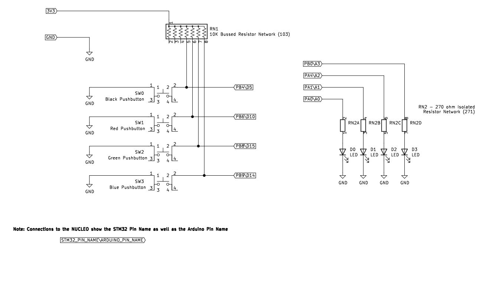

# Microcontroller Simon

This project emulates the 70's/80's game "Simon" on a microcontroller and breadboard with buttons and LEDs (schematic provided).

## How To Play

### Start

After power-on, press any button to start the game. In the meantime, a show of lights will be displayed a la Knight Rider.

### The Game

Once the game starts, a sequence of lights will be displayed one at a time which the player must repeat by pushing the corresponding buttons in order. The game starts with only one light, but adds another light (up to 10) to the sequence each time the player successfully repeats the pattern.

### Game Over

If you managed to successfully follow the pattern for 10 rounds, you win! You will be rewarded with all LEDs flashing on and off until the program is reset.

If you make a mistake somewhere along the way, a single light will flash for 3 seconds and the number of rounds you made it past will be displayed in binary until the program is reset.

## Components
- STM32F103RB microcontroller
- peripheral circuitry, including:
    - breadboard
    - jumper cables
    - 4 buttons
    - 4 LEDs
    - 1 10K ohm bussed resistor network
    - 1 270 ohm isolated resistor network

